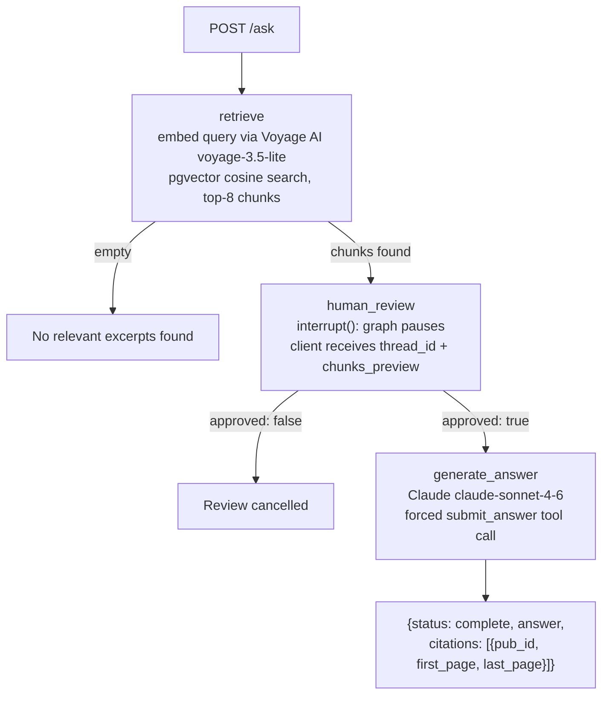

# TaxCite


[github.com/coreystevensdev/taxcite](https://github.com/coreystevensdev/taxcite)

## Overview

Agentic RAG system that answers U.S. tax questions with page-level citations from IRS publications. 92 tests (pytest). Ragas eval harness for faithfulness, answer relevancy, and context precision.

## Problem

IRS publications contain the authoritative answers to most individual tax questions, but they are long, cross-referenced PDFs spread across dozens of documents. Searching them returns pages, not answers. A taxpayer asking "can I deduct mortgage interest on a second home?" has to read Pub 936 end to end to find out.

## Solution

A retrieval-augmented generation pipeline that ingests 14 IRS publications into a pgvector index, embeds queries with Voyage AI, retrieves the most relevant passages, and asks Claude to answer with inline citations. Every answer names the publication and page range it came from, so users can verify the source directly.

## Architecture



The LangGraph state machine has five nodes with two conditional edges. `retrieve` routes to `human_review` when chunks are found, or `no_documents` when the corpus has nothing. `human_review` calls `interrupt()` to pause the graph for human approval of the retrieved excerpts; the graph saves its checkpoint to `MemorySaver`, the server returns an intermediate response with the chunks preview, and `POST /ask/resume` resumes from the saved checkpoint with the human's decision. `generate_answer` forces a structured tool call so citations are always machine-readable rather than extracted from prose.

## Routes

| Method | Path | What it does |
|---|---|---|
| GET | `/health` | Liveness check, no dependencies |
| GET | `/status` | Ingest state (`idle`/`running`/`ready`/`error`) plus chunk counts per publication |
| POST | `/ask` | Runs the graph; returns a complete answer or pauses at `human_review` with a chunks preview |
| POST | `/ask/resume` | Resumes a paused thread from its `MemorySaver` checkpoint with the human's approve/reject decision |

## Eval Harness

Ragas evaluation over 50 questions spanning all 14 ingested IRS publications, scoring faithfulness, answer relevancy, and context precision. Questions include numeric exact-match cases (dollar thresholds, age limits, percentages) and conceptual retrieval cases. Claude judges and voyage-3 embeds, the same models the agent uses, so the eval needs no third provider. Every question's own scores are kept in the report alongside the aggregate, which is what turns a retrieval change into a paired comparison rather than two means that might differ by noise.

Latest run, committed at `eval/report.json`:

| Metric | Score |
|---|---|
| Faithfulness | 0.945 |
| Answer relevancy | 0.633 |
| Context precision | 0.857 |

The corpus is pinned to a tax year, so these are measured against the publications the dataset was written against. Before pinning, `ingest` pulled whatever revision the IRS was currently serving: 7 of the 50 questions asked for 2024 figures the 2025 revisions do not contain, the agent correctly declined to state them, and Ragas scored those refusals as total misses. That alone was worth 0.759 against 0.857 on context precision and 0.911 against 0.945 on faithfulness.

Retrieval pulls 24 candidates and a voyage `rerank-2` cross-encoder narrows them to the 8 the model reads. Vector search scores the query and the chunk in the same space independently, so it measures what a passage is about rather than whether it answers this question; a cross-encoder reads the pair together. Measured against the same corpus without it, context precision went 0.704 to 0.759 and faithfulness 0.891 to 0.911. Two reranked runs landed within 0.004 of each other on context precision, so those gaps are roughly sixteen and fourteen times the observed run-to-run spread. Answer relevancy moved down 0.023, under twice that spread, which is too small to call in either direction.

Those numbers are worth reading alongside what they were a day earlier: **0.464 / 0.136 / 0.102**. The harness had never completed a run, so nothing had ever measured the retrieval path, and three bugs were sitting in it. PDF text came out of `pdfplumber` with the two columns zippered together, so every chunk was two half-sentences from unrelated passages. The IVFFlat index was created during migration, before any rows existed, and IVFFlat derives its centroids from the data present at build time, so on an empty table a query probed one meaningless list out of a hundred: 11 of the 50 questions retrieved nothing at all. Generation then ran at `max_tokens=1024`, which was survivable only while retrieval was returning nothing.

Each one hid the next. An eval that has never run is not a weak signal, it is no signal.

Run after ingestion:

```bash
python -m taxcite eval --dataset eval/dataset.jsonl --out eval/report.json
cat eval/report.json
```

## Tech Stack

| Layer | Technology | Why |
|---|---|---|
| Retrieval | pgvector (ivfflat cosine) | Native PostgreSQL extension; no separate vector DB service |
| Embeddings | Voyage AI voyage-3.5-lite, 1024-dim | Outperforms OpenAI text-embedding-3-small on retrieval benchmarks at lower cost |
| Agent | LangGraph StateGraph | Explicit state machine separates retrieval and generation; conditional routing is auditable |
| Generation | Anthropic claude-sonnet-4-6 | Forced tool call enforces structured citation output |
| Evaluation | Ragas faithfulness + answer_relevancy + context_precision | Standard RAG eval metrics; reproducible with `python -m taxcite eval` |
| Observability | LangSmith traces via `@traceable` + LangGraph auto-instrumentation | Token costs, latency, state transitions, and raw Anthropic messages in one trace tree |
| API | FastAPI + uvicorn | Typed request/response schemas; easy local testing with TestClient |
| PDF parsing | pdfplumber | Page-accurate text extraction with page-number tracking for citations |
| Chunking | Custom overlap chunker | 1600-char target, one-paragraph overlap, page range tracking per chunk |

## Getting Started

```bash
docker compose up -d db        # start pgvector
cp .env.example .env           # fill in API keys
pip install -e ".[eval]"
python -m taxcite ingest       # fetch + parse + chunk + embed all 14 pubs (~5-10 min)
python -m taxcite serve        # start API at http://localhost:8000
curl -X POST http://localhost:8000/ask \
  -H "Content-Type: application/json" \
  -d '{"question": "Can I deduct mortgage interest on my primary home?"}'
```

Or with Docker Compose:

```bash
cp .env.example .env
docker compose up -d
docker compose exec api python -m taxcite ingest
```

## HITL Interrupt/Resume

The API supports human-in-the-loop review before the generation call. When enabled (always on by default), `POST /ask` may return an intermediate response:

```json
{
  "status": "awaiting_review",
  "thread_id": "uuid",
  "chunks_preview": [
    {"pub_id": "p936", "pages": "pp.12-14", "excerpt": "Mortgage interest on your main home..."}
  ]
}
```

Call `POST /ask/resume` to continue:

```bash
curl -X POST http://localhost:8000/ask/resume \
  -H "Content-Type: application/json" \
  -d '{"thread_id": "<uuid>", "approved": true}'
```

The graph resumes from the `MemorySaver` checkpoint and completes generation. Pass `"approved": false` to cancel without a Claude call.

## LangSmith Tracing

Every `graph.invoke()` call is traced to LangSmith when the following env vars are set:

```bash
export LANGCHAIN_API_KEY=lsv2_pt_...   # from smith.langchain.com
export LANGCHAIN_TRACING_V2=true
export LANGCHAIN_PROJECT=taxcite
```

The trace tree per request:

```
LangGraph run
  ├─ retrieve              (node span, auto-instrumented by LangGraph)
  │    └─ embed_query      (embedding span: Voyage AI latency + model)
  ├─ human_review          (node span: shows interrupt payload)
  └─ generate_answer       (llm span: Anthropic messages, token counts, cost)
```

Traces show: LangGraph state transitions (retrieve -> human_review -> generate_answer), the HITL interrupt point and resume event, the raw Anthropic messages payload, token counts and cost per node, Voyage AI embedding latency, and end-to-end latency across both the initial invoke and the resume call.

## Known Limitations

- Context window: retrieves top-8 chunks per question; multi-part questions spanning many publications may miss relevant context.
- No OCR: `pdfplumber` extracts digital text only; scanned pages (some older IRS pubs) are silently skipped.
- Per-instance state: both the rate limiter and the HITL `MemorySaver` checkpointer are in-process. Interrupted threads are lost on restart and not shared across replicas; replace `MemorySaver` with `PostgresSaver` for production durability.
- **The corpus is pinned to one tax year, and the dataset has to move with it.** `TAX_YEAR` in `manifest.py` selects which revision `ingest` fetches, from `pub/irs-prior` where publications are addressed by year, rather than `pub/irs-pdf` which always serves the current one. Changing it means rewriting the dataset's dollar figures to match; leaving them out of step scores correct refusals as failures, which is what happened before pinning. The report records `corpus_tax_year` and flags any question whose ground truth names a different one, so the two drifting apart is visible rather than looking like poor retrieval.
- Answer relevancy at 0.60 is the weakest of the three metrics. Ragas scores it by generating questions from the answer and comparing them to the original, so verbose answers that cover more ground than was asked score lower.
- Column detection is a heuristic: it looks for a density trough in word coverage across the page. It falls back to single-column when it finds none, which is right for covers and full-width tables, but an unusual layout could still be split in the wrong place.
- Publications are ingested as static snapshots; re-ingest when IRS revises a publication (annual cycle for most).

## License

MIT
